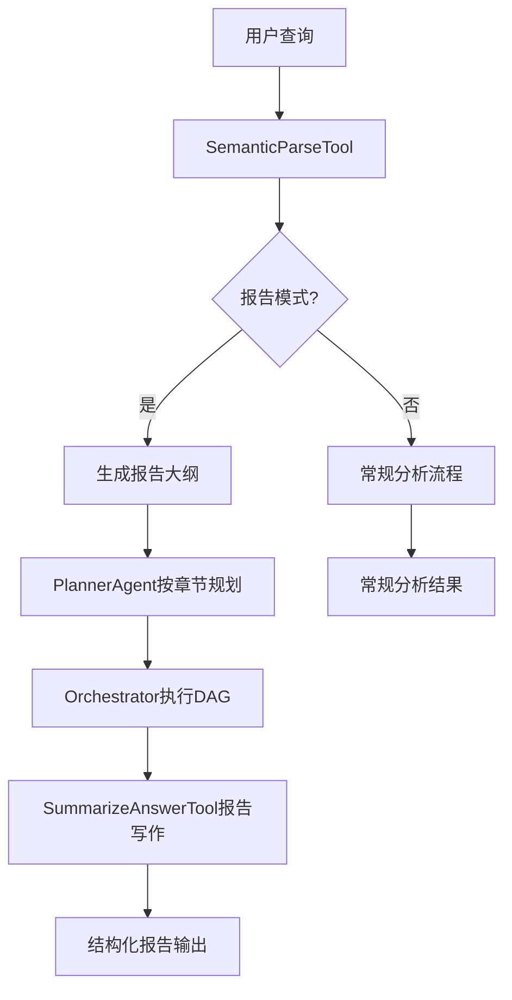

## 用户需求

用户希望在现有ChatDB系统基础上，实现研究分析报告生成功能。

## 产品概述

在ChatDB现有的数据分析能力基础上，增加结构化研究报告生成模式。该功能将复用现有的数据计算引擎，通过扩展语义解析、规划和总结组件，实现从自然语言查询到专业研究报告的完整流程。

## 核心功能

- **报告模式识别**：自动识别用户查询是否需要生成研究报告
- **章节大纲生成**：基于用户查询生成结构化的报告章节大纲
- **多阶段数据分析**：复用现有DAG执行引擎，按章节进行数据收集和分析
- **报告写作模式**：扩展总结工具，支持专业研究报告的结构化输出
- **完整性验证**：确保报告内容完整，数据支撑充分

## 技术栈选择

基于现有ChatDB架构，采用Python生态：

- **核心框架**：复用现有的Agent架构（PlannerAgent、SemanticParseTool、SummarizeAnswerTool）
- **数据处理**：复用现有的SQLAgent和数据库连接器
- **LLM集成**：复用现有的BaseLLM接口
- **存储**：复用现有的ScratchPadManager和TaskHistoryDB

## 实现方案

### 整体架构设计

采用"report_mode"扩展模式，在现有流程的关键节点增加报告相关逻辑：

### 核心技术决策

**1. 最小侵入式设计**

- 在现有组件基础上扩展，而非重写
- 通过`report_mode`标志控制流程分支
- 保持向后兼容性，不影响现有功能

**2. 复用现有执行引擎**

- 利用现有的DAG任务编排能力
- 复用SQLAgent的数据查询能力
- 复用ScratchPadManager的结果管理

**3. 渐进式功能增强**

- 先实现基础报告生成
- 后续可扩展图表生成、模板定制等高级功能

## 实现细节

### 语义解析扩展

扩展`StructuredIntent`支持报告模式：

- 添加`report_mode`字段标识报告生成需求
- 添加`report_outline`字段存储章节大纲
- 保持现有字段兼容性

### 规划器增强

扩展`PlannerAgent`支持按章节规划：

- 检测`report_mode`标志
- 根据报告大纲生成对应的分析任务
- 每个章节对应一个或多个数据分析任务

### 总结工具升级

扩展`SummarizeAnswerTool`支持报告写作：

- 检测`report_mode`标志
- 使用专门的报告写作prompt模板
- 输出结构化的研究报告格式

### 数据流设计

1. **输入**：用户自然语言查询（如"生成2024年流水走势及下滑原因分析报告"）
2. **语义解析**：识别为报告模式，生成章节大纲
3. **任务规划**：为每个章节生成对应的数据分析任务
4. **执行阶段**：复用现有DAG执行引擎
5. **报告生成**：汇总各章节数据，生成结构化报告

## 性能优化

### 执行效率

- 复用现有的并行任务执行能力
- 利用ScratchPadManager的临时表机制避免重复计算
- 通过智能缓存减少重复查询

### 内存管理

- 复用现有的文件暂存机制
- 大数据集通过文件引用传递
- 及时清理临时表和中间结果

### LLM调用优化

- 复用现有的前缀缓存友好设计
- 批量处理相似的章节分析任务
- 智能截断过长的上下文

## 错误处理与可靠性

### 容错机制

- 复用现有的任务重试机制
- 章节分析失败时不影响其他章节
- 提供降级方案（部分章节缺失时仍能生成报告）

### 数据验证

- 复用现有的SQL执行错误处理
- 增加报告完整性检查
- 数据一致性验证

## 扩展性设计

### 模块化架构

- 报告模板可配置化
- 章节类型可扩展
- 输出格式可定制

### 集成能力

- 与现有的技能系统（Skills）集成
- 支持自定义报告模板
- 可集成外部数据源

## Agent Extensions

### Skill

- **skill-creator**
- 目的：创建报告生成相关的技能模块，扩展系统的报告写作能力
- 预期结果：生成专门的报告分析技能，包含报告结构模板和分析方法

### SubAgent  

- **code-explorer**
- 目的：深入探索现有代码库，确保报告功能与现有架构完美集成
- 预期结果：全面了解现有组件的接口和扩展点，确保实现方案的准确性